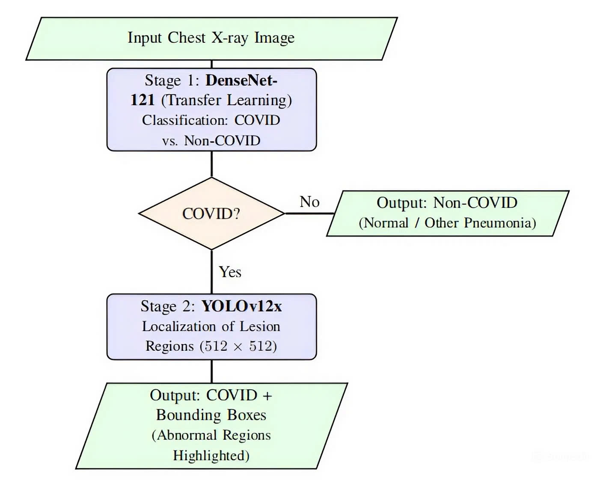

# A Two-Stage Deep Learning Framework for COVID-19 Screening and Lesion Localization from Chest X-ray Images

## Overview

Chest X-ray (CXR) imaging has been widely used as a fast and low-cost screening tool for COVID-19, especially in resource-constrained environments. However, most deep learning approaches focus only on classification and provide limited interpretability.

This project presents a **two-stage deep learning framework** that combines:

- High-sensitivity COVID-19 screening (classification)
- Explicit lesion localization (object detection)

The proposed system aims to bridge the gap between **diagnostic accuracy** and **clinical interpretability**.

---

## Methodology

The framework consists of two independent but sequential stages:

### Stage 1: COVID-19 Classification

- Backbone: DenseNet-121 (pre-trained on ImageNet)
- Task: Binary classification (COVID vs Non-COVID)
- Training strategy:
  - Transfer learning (freeze → fine-tune)
  - Weighted binary cross-entropy
- Input size: 224 × 224

This stage outputs a probability score:

\[
P(\text{COVID})
\]

---

### Stage 2: Lesion Localization

- Model: YOLO-based object detector
- Dataset: SIIM-FISABIO-RSNA
- Input size: 512 × 512
- Output: Bounding boxes of abnormal lung regions

This stage is **conditionally activated** only when:

\[
P(\text{COVID}) > \tau
\]

---

### Inference Pipeline
<p align="center">
  
</p>

1. Input CXR image  
2. Compute COVID probability  
3. If negative → return result  
4. If positive → perform lesion localization  

Final output:
- COVID / Non-COVID prediction  
- Bounding boxes of lung abnormalities  

---

## Datasets

### Classification
- COVID-19 Radiography Database  
- External evaluation:
  - Patients Lungs  
  - COVID CXR Small  

### Localization
- SIIM-FISABIO-RSNA COVID-19 Detection Dataset  

---

## Experimental Results

### Classification Performance

| Model         | Accuracy | Sensitivity | Specificity | AUC   |
|--------------|----------|------------|------------|-------|
| DenseNet-121 | 99.0%    | 96.4%      | 99.4%      | 0.996 |

### Localization Performance

| Model      | mAP@0.5 | Precision | Recall |
|-----------|--------|----------|--------|
| YOLOv12x  | 0.449  | 0.511    | 0.437  |

---

## Key Contributions

- A **two-stage modular framework** separating classification and localization  
- High-sensitivity screening using transfer learning  
- Explicit lesion localization using object detection  
- Cross-dataset evaluation for robustness analysis  
- Practical design aligned with real-world clinical workflows  

---

## Discussion

- Classification achieves near-saturated performance on curated datasets  
- Localization remains challenging due to:
  - Diffuse lung lesions  
  - Weak annotation quality  
  - Low contrast in CXR images  

The results highlight that:

> Localization is the primary bottleneck in COVID-19 CXR analysis.

---

## Conclusion

This work demonstrates that a **modular two-stage design** can effectively combine:

- Strong screening performance  
- Interpretable lesion localization  

The framework provides a practical foundation for **computer-aided diagnosis (CAD)** systems in medical imaging.

---

## Future Work

- Segmentation-based lesion localization  
- Integration of uncertainty estimation  
- Lung region preprocessing  
- Evaluation on large-scale clinical datasets  

---

## Citation

If you use this work, please cite:

```bibtex
@article{tran2025two_stage_covid_cxr,
  title   = {A Two-Stage Deep Transfer Learning Framework for COVID-19 Diagnosis and Lesion Localization from Chest X-ray Images},
  author  = {Tran, Minh Tu and Phan, Ton Loc Nguyen and Ngo, Van Ninh and others},
  year    = {2025},
  note    = {Conference manuscript / preprint}
}
```

---

## Contact

For questions or collaboration:

- Minh Tu Tran  
- Email: cseminhtu@gmail.com


For academic questions, collaborations, or implementation issues, please open an issue in this repository or contact the corresponding author listed in the paper.
# C19-Screen-Loc
