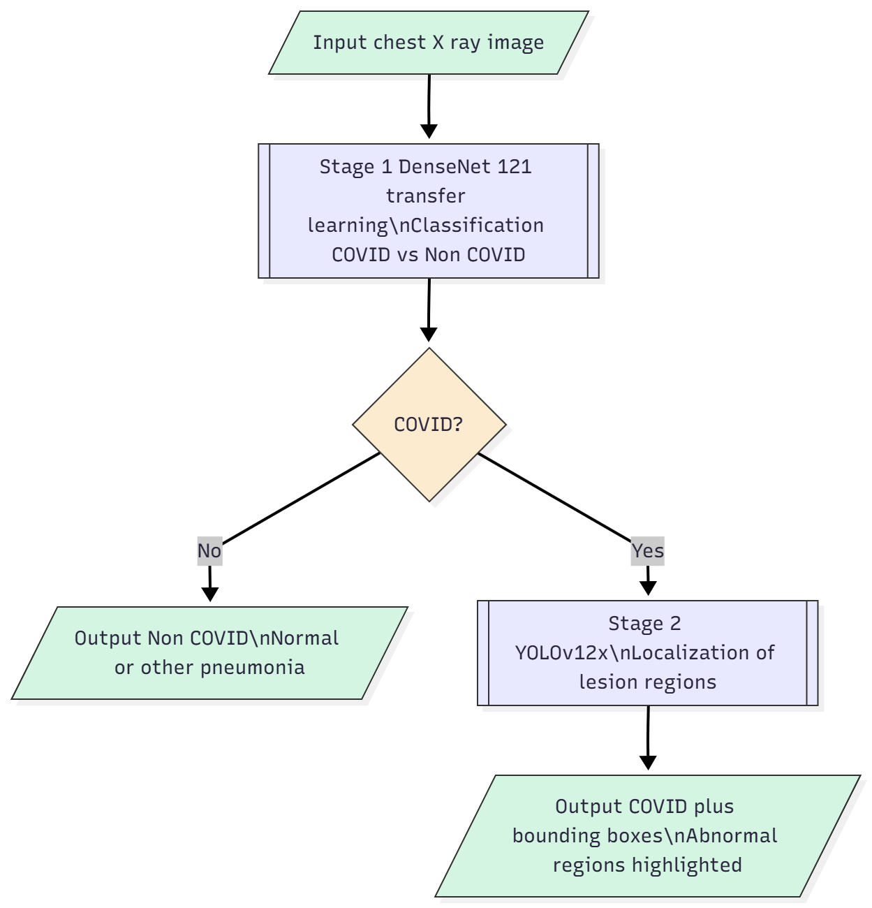

# A Two-Stage Deep Transfer Learning Framework for COVID-19 Diagnosis and Lesion Localization from Chest X-ray Images

This repository presents the implementation and project structure for our two-stage deep transfer learning framework for **COVID-19 diagnosis** and **lung lesion localization** from **chest X-ray (CXR)** images.

The framework is designed as a sequential pipeline:

- **Stage 1 – Classification:** DenseNet-121, EfficientNetB0, and ResNet50 are fine-tuned to classify CXR images as **COVID** or **Non-COVID**.
- **Stage 2 – Localization:** if Stage 1 predicts COVID, the image is forwarded to **YOLOv12x** to localize abnormal lung regions.

> **Important note**
> 
> This repository is currently prepared as a **research release scaffold**. The paper results, documentation, figures, and project organization are included here. If you want full reproducibility, the next step is to add your actual training and inference source code, trained weights, and dataset preparation scripts.

---

## 1. Overview

COVID-19 screening from chest X-rays has attracted significant attention because CXR is inexpensive, fast, and widely available. However, many prior approaches focus only on classification, while others provide weak interpretability through heatmaps alone. Our work proposes a **two-stage pipeline** that combines:

1. **high-sensitivity binary classification** for screening, and  
2. **direct lesion localization** for better interpretability.

This design separates the tasks into two specialized models rather than forcing a single end-to-end model to solve both problems.

---

## 2. Proposed Framework

<p align="center">
  
</p>

**Pipeline summary:**

- Input: chest X-ray image
- Stage 1: DenseNet-121 transfer learning classifier predicts COVID vs Non-COVID
- Decision gate: only predicted COVID samples are sent to Stage 2
- Stage 2: YOLOv12x localizes lesion regions
- Output: final diagnostic label and lesion bounding boxes (if COVID)

---

## 3. Main Results

### Stage 1 – Classification

| Model | Accuracy | Sensitivity | Specificity | AUC | Precision |
|---|---:|---:|---:|---:|---:|
| DenseNet-121 | **99.0%** | **96.4%** | **99.4%** | **0.9961** | **0.9926** |
| EfficientNetB0 | 96.3% | 92.0% | 96.0% | 0.9300 | 0.9230 |
| ResNet50 | 92.1% | 62.0% | 98.0% | 0.9538 | 0.9200 |

DenseNet-121 was selected as the primary classifier because it provided the best balance of **screening sensitivity** and **overall discrimination**.

### Additional Generalization Checks

- **Stratified 5-Fold hold-out evaluation (fold 0):** Accuracy 98.02%, Precision 98.86%, Recall 98.75%, AUC 0.9948, Loss 0.0505
- **Patients Lungs external test:** Accuracy 96.94%, Precision 90.32%, Recall 100%, Specificity 95.71%, F1-score 94.91%
- **COVID CXR Small external test:** Accuracy 95.78%, Precision 90.11%, Recall 93.11%, Specificity 96.66%, F1-score 91.59%

### Stage 2 – Localization

| Model | mAP@0.5 | mAP@0.5:0.95 | Precision | Recall |
|---|---:|---:|---:|---:|
| YOLOv5x6u | 0.418 | 0.158 | 0.462 | 0.444 |
| YOLOv8x | 0.413 | 0.158 | 0.494 | 0.434 |
| YOLOv11x | 0.419 | 0.163 | 0.505 | 0.408 |
| YOLOv12x | **0.449** | **0.174** | **0.511** | **0.437** |

YOLOv12x achieved the strongest localization performance among the tested YOLO variants, although localization remains the bottleneck of the overall system.

---

## 4. Datasets

### 4.1 Classification dataset
**COVID-19 Radiography Database**

Original classes:
- COVID-19
- Normal
- Lung Opacity
- Viral Pneumonia

For Stage 1, the labels are normalized into:
- **COVID**
- **Non-COVID** = Normal + Lung Opacity + Viral Pneumonia

Total images used in the paper: **19,165**

### 4.2 Localization dataset
**SIIM-FISABIO-RSNA COVID-19 Detection**

This dataset provides chest X-ray images with lesion bounding boxes and is used for Stage 2 lesion localization.

> Please respect the license and usage policy of each dataset. This repository does **not** redistribute the original medical images.

---

## 5. Experimental Setup

### Stage 1 – Classification
- Input size: **224 × 224**
- Split strategy: **patient-wise split**
- Data split: **80% train / 10% validation / 10% test**
- Training strategy:
  - **Phase 1:** freeze backbone, train classification head
  - **Phase 2:** unfreeze final blocks for fine-tuning
- Loss: **Weighted Binary Cross-Entropy**
- Class weights: **COVID = 2.93**, **Non-COVID = 0.60**
- Optimizer: **Adam**
- Learning rate:
  - Phase 1: **1e-3**
  - Phase 2: **1e-4 to 1e-5**
- Callbacks: **ReduceLROnPlateau**, **EarlyStopping**, **ModelCheckpoint**

### Stage 2 – Localization
- Model: **YOLOv12x**
- Input size: **512 × 512**
- Optimizer: **SGD**
- Initial learning rate: **0.01** with cosine decay
- Epochs: **200**
- Batch size: **16**
- Augmentations: **mosaic, mixup, horizontal flip, random scale, random erasing**

---

## 6. Repository Structure

```text
covid19_two_stage_repo/
├── assets/                  # Figures used in README and docs
├── docs/                    # Paper notes, reproducibility notes, citations
├── notebooks/               # Exploratory notebooks
├── results/                 # Output plots, confusion matrices, ROC, sample predictions
├── scripts/                 # Dataset prep / training launcher scripts
├── src/
│   ├── classification/      # DenseNet / ResNet / EfficientNet training code
│   └── localization/        # YOLO training and inference code
├── .gitignore
├── README.md
├── PROJECT_STRUCTURE.md
├── REPRODUCIBILITY_CHECKLIST.md
└── requirements.txt
```

---

## 7. What should be added next

To turn this scaffold into a complete public research repo, add:

- dataset preparation scripts
- training scripts for Stage 1 and Stage 2
- inference pipeline that chains classification → localization
- sample pretrained weights or links to downloadable checkpoints
- result figures exported from your experiments
- a small demo app (Gradio / Streamlit / Flask)

---

## 8. Suggested Commands

These commands are placeholders and should be updated once your code is added.

### Install dependencies
```bash
pip install -r requirements.txt
```

### Train Stage 1 classifier
```bash
python scripts/train_classification.py --config configs/classification.yaml
```

### Train Stage 2 localizer
```bash
python scripts/train_localization.py --config configs/localization.yaml
```

### Run end-to-end inference
```bash
python scripts/infer_pipeline.py --image path/to/cxr.png
```

---

## 9. Limitations

- The repository currently does **not** include original datasets.
- Full reproducibility still depends on uploading your actual source code and model checkpoints.
- The localization stage is weaker than the classification stage, partly due to annotation noise and the diffuse nature of lung lesions in CXR.
- This work is intended as a **research-support system**, not a clinical deployment.

---

## 10. Citation

If you use this work, please cite:

```bibtex
@article{tran2025two_stage_covid_cxr,
  title   = {A Two-Stage Deep Transfer Learning Framework for COVID-19 Diagnosis and Lesion Localization from Chest X-ray Images},
  author  = {Tran, Minh Tu and Phan, Ton Loc Nguyen and Ngo, Van Ninh and others},
  year    = {2025},
  note    = {Conference manuscript / preprint}
}
```

> Update the BibTeX entry after your final venue, DOI, or IEEE metadata is available.

---

## 11. Acknowledgements

We thank the maintainers of the public datasets and prior open research on chest X-ray based COVID-19 analysis.

---

## 12. Contact

For academic questions, collaborations, or implementation issues, please open an issue in this repository or contact the corresponding author listed in the paper.
# C19-Screen-Loc
